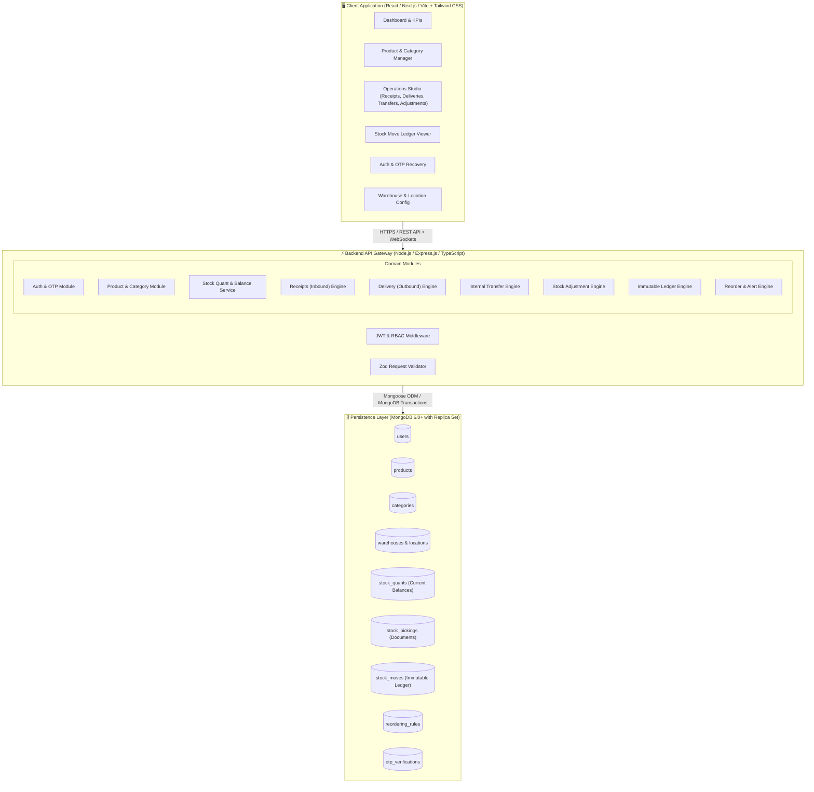
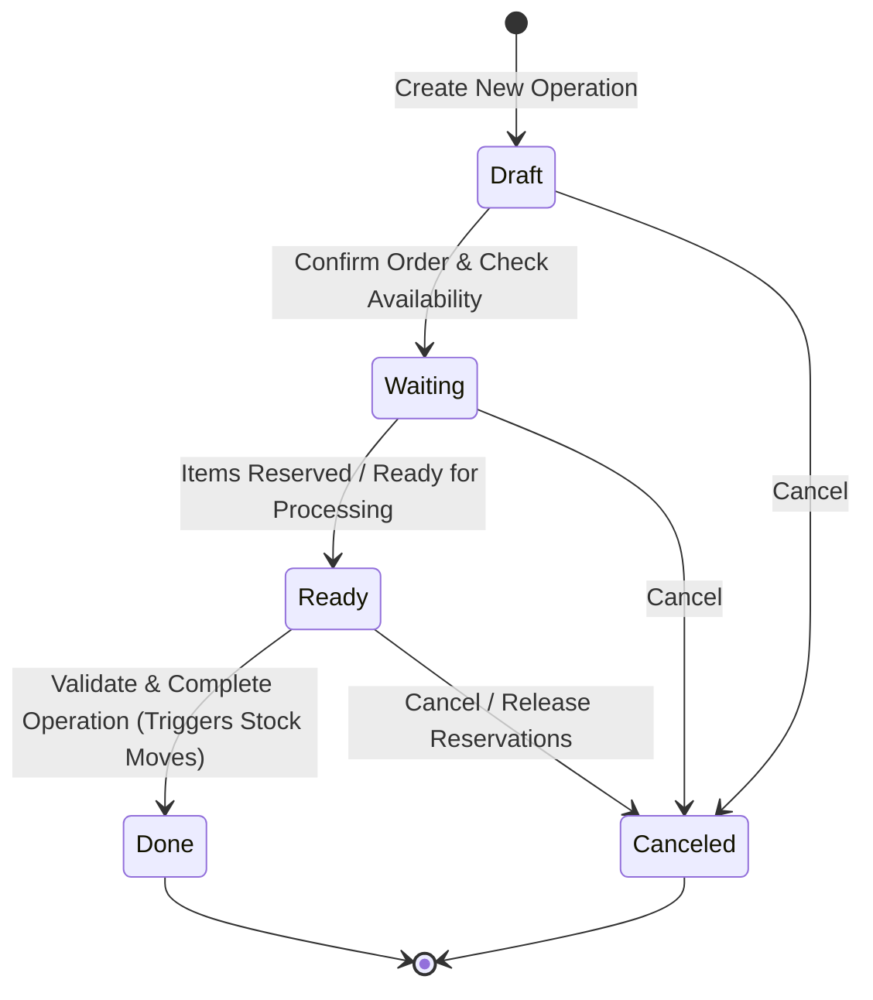
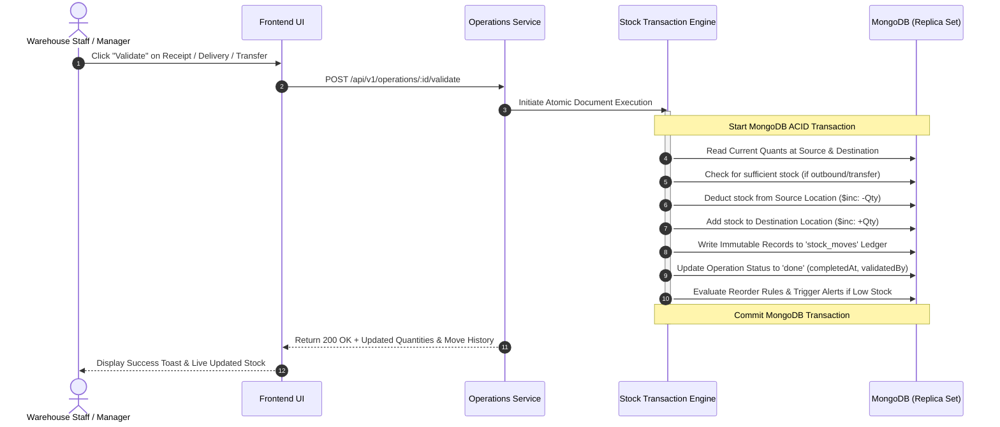
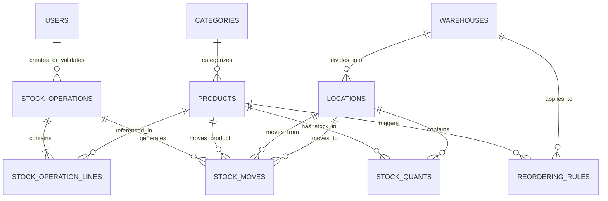

# 📦 StockSense — Modular Inventory Management System (IMS)

<div align="center">


**A modern, modular, real-time Inventory Management System designed to replace manual registers, error-prone spreadsheets, and fragmented tracking tools with an automated single source of truth.**

[🎨 View Excalidraw UI Mockup](https://link.excalidraw.com/l/65VNwvy7c4X/3ENvQFu9o8R) • [🏗 System Architecture](#-system-architecture) • [🗄 MongoDB Database Design](#-mongodb-database-architecture) • [🔄 Inventory Workflows](#-core-operations--inventory-workflows) • [🚀 API Reference](#-rest-api-specification) • [⚡ Quick Start](#-installation--setup)

</div>

---

## 📌 Executive Summary & Problem Statement

Modern warehouses and retail supply chains struggle with:
- **Scattered Excel Spreadsheets & Physical Registers:** Leading to phantom stock, mismatched inventory, and human data-entry blunders.
- **Blind Stockouts & Overstocking:** Lack of real-time visibility into incoming shipments vs. pending customer deliveries.
- **Untracked Internal Transfers:** Stock moving between production lines, racks, and auxiliary warehouses without timestamped accountability.
- **Audit Nightmares:** Physical stock counts failing to reconcile with books due to missing adjustment logs.

**StockSense** solves this by providing a **double-entry transaction engine** backed by **MongoDB**. Every physical movement—whether an inbound supplier receipt, internal rack-to-rack transfer, outbound customer delivery, or manual cycle-count adjustment—is recorded as an immutable ledger entry, guaranteeing end-to-end auditability and zero stock discrepancies.

---

## 👥 Target Users & Access Roles

| Role | Responsibilities | System Capabilities |
|---|---|---|
| **Inventory Manager** | Inbound/outbound oversight, supplier & customer management, catalog governance, and high-level inventory auditing. | • Create & edit products, categories, and UoM.<br>• Set automated reordering rules (Min/Max thresholds).<br>• Approve & validate high-value stock adjustments.<br>• Access full analytics, KPI dashboard, and export stock valuation. |
| **Warehouse Staff** | Physical floor execution, order fulfillment, shelving, rack transfers, and cycle counts. | • Scan & receive vendor shipments (Receipts).<br>• Pick, pack, and ship customer orders (Delivery Orders).<br>• Execute internal movements (Warehouse/Rack transfers).<br>• Perform physical stock counts and submit adjustments. |

---

## 🎨 UI/UX Mockup & Wireframe

The complete user interface wireframe and workflow blueprints are available on Excalidraw:

👉 **[Excalidraw Mockup Link: StockSense Interactive UI Flow](https://link.excalidraw.com/l/65VNwvy7c4X/3ENvQFu9o8R)**

### Key Mockup Screens Mapped
1. **Authentication & OTP Reset Modal:** Clean login/signup with fast email/SMS OTP recovery.
2. **Operations Dashboard:** Live KPI stat cards, dynamic multi-facet filtering table, and quick-action bar.
3. **Product Catalog & Stock Matrix:** Product cards with location-specific availability badges.
4. **Operation Studio (Receipts / Deliveries / Transfers / Adjustments):** Document status bar (`Draft` ➔ `Waiting` ➔ `Ready` ➔ `Done` ➔ `Canceled`), source/destination selectors, and line-item manager.
5. **Stock Move Ledger:** Tabular view of every atomic stock move with filterable source/dest locations and timestamps.
6. **Warehouse & Location Hierarchy Builder:** Tree-view configuration of Warehouses, Zones, Aisles, and Racks.

---

## 🏗 System Architecture

StockSense follows a **Modular Clean Architecture** powered by a **Double-Entry Stock Ledger** pattern to ensure absolute transactional integrity.

### 1. High-Level Modular Architecture



---

### 2. Document & Operations Lifecycle State Machine

All four operational documents (**Receipts**, **Delivery Orders**, **Internal Transfers**, and **Adjustments**) follow a standardized state machine:



---

### 3. Core Stock Movement Data Flow (Double-Entry Engine)

Every transaction balances a **Source Location** (`location_src_id`) and a **Destination Location** (`location_dest_id`):



---

## 🗄 MongoDB Database Architecture

MongoDB is chosen for its **document flexibility**, **nested line-item schemas**, **sub-document indexing**, and **high-throughput ACID multi-document transactions**.

### MongoDB Entity Relationship Model



---

### Detailed Schema Specifications

#### 1. `users` Collection
Stores authentication, roles, and security metadata.
```json
{
  "_id": { "$oid": "65f01a1b2c3d4e5f6a7b8c90" },
  "name": "Sarah Connor",
  "email": "sarah.connor@stocksense.io",
  "passwordHash": "$2b$12$e8Y4vLz9N...",
  "role": "INVENTORY_MANAGER", // "INVENTORY_MANAGER" | "WAREHOUSE_STAFF"
  "phone": "+1-555-0199",
  "isActive": true,
  "lastLogin": { "$date": "2026-09-26T10:30:00.000Z" },
  "createdAt": { "$date": "2026-01-15T08:00:00.000Z" }
}
```

#### 2. `products` Collection
Stores master product catalog, barcodes, categories, and units of measure.
```json
{
  "_id": { "$oid": "65f01a1b2c3d4e5f6a7b8c91" },
  "name": "Heavy Duty Steel Rod 20mm",
  "sku": "STL-ROD-020",
  "barcode": "8901234567890",
  "categoryId": { "$oid": "65f01a1b2c3d4e5f6a7b8c92" },
  "uom": "kg", // "units" | "kg" | "meters" | "liters" | "boxes"
  "costPrice": 45.50,
  "salePrice": 68.00,
  "minStockAlert": 50,
  "maxStockCapacity": 500,
  "isActive": true,
  "createdAt": { "$date": "2026-01-15T09:00:00.000Z" }
}
```

#### 3. `warehouses` & `locations` Collection
Hierarchical storage model supporting physical warehouses, internal racks, virtual vendor locations (inbound source), customer locations (outbound destination), and inventory loss/scrap accounts.
```json
{
  "_id": { "$oid": "65f01a1b2c3d4e5f6a7b8c93" },
  "name": "Main Central Warehouse",
  "code": "WH-MAIN",
  "address": {
    "street": "100 Logistics Blvd",
    "city": "Chicago",
    "state": "IL",
    "zip": "60601"
  },
  "locations": [
    {
      "_id": { "$oid": "65f01a1b2c3d4e5f6a7b8c94" },
      "name": "Stock / Zone A / Rack 01",
      "code": "WH-MAIN/ZONE-A/RACK-01",
      "type": "internal" // "internal" | "vendor" | "customer" | "inventory_loss" | "transit"
    },
    {
      "_id": { "$oid": "65f01a1b2c3d4e5f6a7b8c95" },
      "name": "Production Floor Rack",
      "code": "WH-MAIN/PROD-FLOOR",
      "type": "internal"
    }
  ]
}
```

#### 4. `stock_quants` Collection (Real-Time Stock Levels)
Fast-lookup balance table holding on-hand, reserved, and available stock per product per location.
```json
{
  "_id": { "$oid": "65f01a1b2c3d4e5f6a7b8c96" },
  "productId": { "$oid": "65f01a1b2c3d4e5f6a7b8c91" },
  "warehouseId": { "$oid": "65f01a1b2c3d4e5f6a7b8c93" },
  "locationId": { "$oid": "65f01a1b2c3d4e5f6a7b8c94" },
  "quantityOnHand": 100.0,
  "quantityReserved": 20.0,
  "quantityAvailable": 80.0, // calculated as: quantityOnHand - quantityReserved
  "updatedAt": { "$date": "2026-09-26T11:00:00.000Z" }
}
```

#### 5. `stock_operations` Collection (Documents: Receipts, Deliveries, Transfers, Adjustments)
Unified schema representing all operational stock documents.
```json
{
  "_id": { "$oid": "65f01a1b2c3d4e5f6a7b8c97" },
  "documentNumber": "REC/2026/00042", // e.g. "REC/...", "DEL/...", "INT/...", "ADJ/..."
  "type": "RECEIPT", // "RECEIPT" | "DELIVERY" | "INTERNAL" | "ADJUSTMENT"
  "status": "done", // "draft" | "waiting" | "ready" | "done" | "canceled"
  "partnerName": "Tata Steel Supply Co.",
  "sourceLocationId": { "$oid": "65f01a1b2c3d4e5f6a7b8c98" }, // Virtual Vendor Location
  "destLocationId": { "$oid": "65f01a1b2c3d4e5f6a7b8c94" }, // Internal WH-MAIN Rack 01
  "scheduledDate": { "$date": "2026-09-26T10:00:00.000Z" },
  "completedAt": { "$date": "2026-09-26T10:45:00.000Z" },
  "createdBy": { "$oid": "65f01a1b2c3d4e5f6a7b8c90" },
  "validatedBy": { "$oid": "65f01a1b2c3d4e5f6a7b8c90" },
  "lines": [
    {
      "productId": { "$oid": "65f01a1b2c3d4e5f6a7b8c91" },
      "productName": "Heavy Duty Steel Rod 20mm",
      "sku": "STL-ROD-020",
      "demandQty": 50.0,
      "doneQty": 50.0,
      "uom": "kg",
      "unitPrice": 45.50
    }
  ],
  "notes": "Delivered on truck #IL-9942 without damages."
}
```

#### 6. `stock_moves` Collection (Immutable Stock Ledger)
The double-entry immutable financial and quantity ledger.
```json
{
  "_id": { "$oid": "65f01a1b2c3d4e5f6a7b8c99" },
  "operationId": { "$oid": "65f01a1b2c3d4e5f6a7b8c97" },
  "documentNumber": "REC/2026/00042",
  "productId": { "$oid": "65f01a1b2c3d4e5f6a7b8c91" },
  "sourceLocationId": { "$oid": "65f01a1b2c3d4e5f6a7b8c98" }, // Virtual/Vendor
  "destLocationId": { "$oid": "65f01a1b2c3d4e5f6a7b8c94" },   // Physical Rack
  "quantity": 50.0,
  "uom": "kg",
  "costAtMove": 45.50,
  "performedBy": { "$oid": "65f01a1b2c3d4e5f6a7b8c90" },
  "timestamp": { "$date": "2026-09-26T10:45:00.000Z" }
}
```

#### 7. `reordering_rules` Collection
Automated procurement and restocking triggers.
```json
{
  "_id": { "$oid": "65f01a1b2c3d4e5f6a7b8c9a" },
  "productId": { "$oid": "65f01a1b2c3d4e5f6a7b8c91" },
  "warehouseId": { "$oid": "65f01a1b2c3d4e5f6a7b8c93" },
  "locationId": { "$oid": "65f01a1b2c3d4e5f6a7b8c94" },
  "minQuantity": 20.0,
  "maxQuantity": 100.0,
  "preferredSupplier": "Tata Steel Supply Co.",
  "isActive": true
}
```

#### 8. `otp_verifications` Collection
Temporary collection with TTL index for fast, secure password reset OTPs.
```json
{
  "_id": { "$oid": "65f01a1b2c3d4e5f6a7b8c9b" },
  "email": "sarah.connor@stocksense.io",
  "otpHash": "$2b$10$w81o9s...",
  "purpose": "PASSWORD_RESET",
  "expiresAt": { "$date": "2026-09-26T11:30:00.000Z" },
  "isVerified": false,
  "createdAt": { "$date": "2026-09-26T11:20:00.000Z" }
}
```

---

## 🔄 Core Operations & Inventory Workflows

### 1. Inbound Receipts (Vendor ➔ Warehouse)
*Used when purchasing raw materials or finished goods from suppliers.*
- **Step 1:** Create new Receipt document, select Supplier (Partner) and destination warehouse location.
- **Step 2:** Add expected line items (SKU, description, expected quantity, unit cost).
- **Step 3:** Physical goods arrive at the loading bay; warehouse staff performs quality check and inputs `doneQty`.
- **Step 4:** Click **Validate** ➔ MongoDB transaction executes:
  - Updates `stock_quants` for product in destination location (`$inc: { quantityOnHand: +doneQty }`).
  - Writes audit move to `stock_moves` ledger.
  - Document status marked as `done`.

### 2. Outbound Delivery Orders (Warehouse ➔ Customer)
*Used when shipping sales orders to customers.*
- **Step 1:** Create Delivery Order for customer with destination address and required items.
- **Step 2 (Reservation):** System automatically checks `quantityAvailable` across locations and reserves requested quantity (`$inc: { quantityReserved: +demandQty }`).
- **Step 3 (Pick & Pack):** Warehouse staff picks items from designated racks into staging boxes.
- **Step 4 (Validation):** Click **Validate** ➔ MongoDB transaction executes:
  - Deducts on-hand stock and frees reservations (`$inc: { quantityOnHand: -doneQty, quantityReserved: -doneQty }`).
  - Writes outbound record to `stock_moves` ledger (`from: WH-MAIN/Rack-01`, `to: Virtual/Customer`).
  - Document status marked as `done`.

### 3. Internal Transfers (Location A ➔ Location B)
*Used for rebalancing stock between warehouses, moving goods to production lines, or reorganizing racks.*
- **Example:** Transfer 30 kg Steel from `Main Store` to `Production Rack`.
- Total company inventory count remains unchanged, but location-specific quants are updated:
  - Source location: `-30 kg`
  - Destination location: `+30 kg`
- Logged in the ledger for location tracking.

### 4. Stock Adjustments (Cycle Count Reconciliation)
*Used to correct mismatches discovered during physical inventory counts.*
- **Step 1:** Select Warehouse, Location, and Product.
- **Step 2:** System displays current **Recorded Quantity** (e.g., 50 units).
- **Step 3:** Staff inputs **Counted Quantity** (e.g., 47 units due to damaged/missing items).
- **Step 4:** System calculates discrepancy (`-3 units`).
- **Step 5 (Validation):** Auto-updates `stock_quants` to 47 and writes adjustment ledger entry (`from: WH-MAIN/Rack-01`, `to: Virtual/Inventory Loss`, `quantity: 3`).

---

## 📊 End-to-End Concrete Inventory Flow Example

Let us trace a real-world multi-step scenario for **Steel Rods (kg)**:

| Step | Operation Type | Action Description | Stock Quant Impact | Total Company Stock | Stock Ledger Log |
|---|---|---|---|---|---|
| **Step 1** | **Receipt** (`REC/001`) | Received 100 kg Steel from Supplier at Main Store | `Main Store`: +100 kg | **100 kg** | `[Vendor] ➔ [Main Store]: +100 kg` |
| **Step 2** | **Internal Transfer** (`INT/001`) | Moved 40 kg from Main Store to Production Floor | `Main Store`: 60 kg<br>`Prod Floor`: 40 kg | **100 kg** | `[Main Store] ➔ [Prod Floor]: 40 kg` |
| **Step 3** | **Delivery Order** (`DEL/001`) | Delivered 20 kg finished frame to Customer | `Prod Floor`: 20 kg | **80 kg** | `[Prod Floor] ➔ [Customer]: -20 kg` |
| **Step 4** | **Stock Adjustment** (`ADJ/001`) | Discovered 3 kg damaged in Production Floor | `Prod Floor`: 17 kg | **77 kg** | `[Prod Floor] ➔ [Scrap/Loss]: -3 kg` |

---

## 🧭 Navigation & Module Hierarchy

```
StockSense App
├── 🔐 Authentication & Security
│   ├── Login / Signup
│   └── OTP-Based Password Reset (Email/SMS verification)
│
├── 📊 Inventory Dashboard (Landing Page)
│   ├── KPI Summary Cards
│   │   ├── 📦 Total Products in Stock
│   │   ├── ⚠️ Low Stock / Out of Stock Items
│   │   ├── 📥 Pending Receipts
│   │   ├── 📤 Pending Deliveries
│   │   └── 🔄 Internal Transfers Scheduled
│   └── Dynamic Filter Matrix
│       ├── Document Type (Receipts / Deliveries / Internal / Adjustments)
│       ├── Status (Draft / Waiting / Ready / Done / Canceled)
│       ├── Warehouse & Location
│       └── Product Category
│
├── 🏷️ 1. Products Management
│   ├── Product Catalog & Search (SKU / Barcode)
│   ├── Create / Edit Product (Name, SKU, Category, UoM, Pricing)
│   ├── Stock Availability per Location Matrix
│   ├── Product Categories Hierarchy
│   └── Automated Reordering Rules (Min / Max thresholds)
│
├── ⚡ 2. Operations Studio
│   ├── 📥 Inbound Receipts (Vendor Ingestion)
│   ├── 📤 Outbound Delivery Orders (Customer Picking & Packing)
│   ├── 🔄 Internal Transfers (Rack-to-Rack / Warehouse-to-Warehouse)
│   ├── ⚖️ Stock Adjustments (Physical vs. Recorded Reconciliation)
│   └── 📜 Move History & Stock Ledger (Immutable Audit Logs)
│
├── ⚙️ 3. Settings & Configuration
│   ├── Warehouse Management (Warehouses & Physical Locations)
│   ├── Units of Measure (UoM) Configuration
│   └── System Alert Thresholds
│
└── 👤 4. Profile & Session
    ├── My Profile & Role Information
    └── Secure Logout
```

---

## 🚀 REST API Specification

### Authentication & User Management
| Method | Endpoint | Description | Role Required |
|---|---|---|---|
| `POST` | `/api/v1/auth/signup` | Register new staff / manager account | Public |
| `POST` | `/api/v1/auth/login` | Authenticate & issue JWT Bearer Token | Public |
| `POST` | `/api/v1/auth/forgot-password` | Send 6-digit OTP to user email/phone | Public |
| `POST` | `/api/v1/auth/verify-otp-reset` | Validate OTP & set new password | Public |
| `GET` | `/api/v1/auth/me` | Fetch logged-in user profile & permissions | Authenticated |

### Dashboard Analytics
| Method | Endpoint | Description |
|---|---|---|
| `GET` | `/api/v1/dashboard/kpis` | Fetch counts for total stock, low stock, pending receipts/deliveries/transfers |
| `GET` | `/api/v1/dashboard/operations` | Query filtered operations list by type, status, warehouse, and date |

### Product & Category Management
| Method | Endpoint | Description |
|---|---|---|
| `GET` | `/api/v1/products` | Paginated product list with stock availability across locations |
| `POST` | `/api/v1/products` | Create a new product with SKU, barcode, category, and UoM |
| `GET` | `/api/v1/products/:id` | Get detailed product breakdown and location quants |
| `PUT` | `/api/v1/products/:id` | Update product metadata and reordering thresholds |
| `GET` | `/api/v1/categories` | List all product category hierarchies |
| `POST` | `/api/v1/categories` | Create a new product category |

### Operations & Stock Movements
| Method | Endpoint | Description |
|---|---|---|
| `GET` | `/api/v1/operations` | Filter operations by `type`, `status`, `warehouseId` |
| `POST` | `/api/v1/operations` | Create new operation document (`RECEIPT`, `DELIVERY`, `INTERNAL`, `ADJUSTMENT`) |
| `GET` | `/api/v1/operations/:id` | Fetch full operation document with line items |
| `PUT` | `/api/v1/operations/:id` | Edit draft lines, quantities, and partners |
| `POST` | `/api/v1/operations/:id/confirm` | Confirm operation (Move `draft` ➔ `waiting`/`ready`) |
| `POST` | `/api/v1/operations/:id/validate` | Execute atomic stock transaction & generate ledger entries |
| `POST` | `/api/v1/operations/:id/cancel` | Cancel operation and release reservations |
| `GET` | `/api/v1/ledger/moves` | Query full immutable stock move history with date/location filters |

### Warehouse & Locations
| Method | Endpoint | Description |
|---|---|---|
| `GET` | `/api/v1/warehouses` | List all warehouses and child location zones |
| `POST` | `/api/v1/warehouses` | Create a new warehouse facility |
| `POST` | `/api/v1/warehouses/:id/locations` | Add rack/aisle/shelf location to a warehouse |

---

## 🛠️ Technology Stack

```
Frontend:
├── Framework: React 18+ / Next.js / Vite
├── Language: TypeScript
├── Styling: Tailwind CSS (Clean modern ERP UI with dark/light mode)
├── Icons: Lucide React
├── Data Fetching: TanStack React Query + Axios
└── State Management: Zustand

Backend:
├── Runtime: Node.js (v18+)
├── Framework: Express.js / TypeScript
├── Database ODM: Mongoose (MongoDB 6.0+)
├── Validation: Zod Schema Validation
├── Authentication: JWT + Bcrypt + OTP Engine (Crypto/Nodemailer/Twilio)
└── Realtime: Socket.io (Instant stockout and status notifications)
```

---

## ⚡ Installation & Setup

### Prerequisites
- **Node.js**: v18.0.0 or higher
- **MongoDB**: v6.0+ (Local MongoDB Server or MongoDB Atlas Connection String with Replica Set enabled for transactions)
- **npm** or **pnpm** / **yarn**

### 1. Clone Repository
```bash
git clone https://github.com/your-org/stocksense.git
cd stocksense
```

### 2. Configure Environment Variables
Create a `.env` file in the root directory:
```env
# Server Configuration
PORT=5000
NODE_ENV=development

# MongoDB Connection
MONGODB_URI=mongodb+srv://<username>:<password>@cluster0.mongodb.net/stocksense?retryWrites=true&w=majority

# JWT Authentication
JWT_SECRET=super_secret_jwt_key_stocksense_2026
JWT_EXPIRES_IN=7d

# OTP Email / SMS Configuration
SMTP_HOST=smtp.mailtrap.io
SMTP_PORT=2525
SMTP_USER=your_smtp_user
SMTP_PASS=your_smtp_password
OTP_EXPIRY_MINUTES=10

# Client URL (for CORS)
CLIENT_URL=http://localhost:3000
```

### 3. Install Dependencies
```bash
# Install backend dependencies
npm install

# (If separate client folder exists)
cd client && npm install && cd ..
```

### 4. Seed Initial Data (Warehouses, Categories, Sample Products)
```bash
npm run seed
```

### 5. Launch Development Server
```bash
# Run server & client concurrently
npm run dev
```
- **Backend API**: `http://localhost:5000/api/v1`
- **Frontend App**: `http://localhost:3000`

---

## 📁 Repository Directory Structure

```
stocksense/
├── src/
│   ├── config/             # Database connection, environment variables & constants
│   ├── middleware/         # Auth, RBAC guards, error handler, Zod validators
│   ├── models/             # Mongoose schemas (Product, Quant, Operation, Move, User, Warehouse)
│   ├── modules/
│   │   ├── auth/           # Login, signup, OTP password reset controllers & services
│   │   ├── dashboard/      # KPI aggregations & filter queries
│   │   ├── products/       # Product catalog, categories, and UoM handlers
│   │   ├── receipts/       # Inbound goods receipt handlers
│   │   ├── deliveries/     # Outbound picking & packing handlers
│   │   ├── transfers/      # Internal rack & warehouse movement handlers
│   │   ├── adjustments/    # Cycle count reconciliation handlers
│   │   ├── ledger/         # Stock move audit query services
│   │   └── warehouses/     # Facility & location hierarchy handlers
│   ├── services/           # Double-entry ledger engine & MongoDB transaction runner
│   ├── utils/              # Barcode generator, logger, OTP generator
│   └── app.ts              # Express application configuration & route binding
├── client/                 # Frontend React/Vite UI
│   ├── src/
│   │   ├── components/     # Reusable UI components (Modals, Tables, StatCards, Navbar, Sidebar)
│   │   ├── pages/          # Dashboard, Products, Operations, Ledger, Settings, Profile
│   │   ├── hooks/          # React Query hooks & Socket listener hooks
│   │   ├── store/          # Zustand authentication & filter stores
│   │   └── services/       # Axios API client functions
├── tests/                  # Integration & unit tests for stock transactions
├── .env.example
├── package.json
└── README.md
```

---

## 🛡️ License

This project is licensed under the **MIT License** — see the [LICENSE](LICENSE) file for details.

---

<div align="center">
  <sub>Built with ❤️ for High-Efficiency Warehouse & Supply Chain Teams.</sub><br>
  <sub>Mockup blueprint available on <a href="https://link.excalidraw.com/l/65VNwvy7c4X/3ENvQFu9o8R">Excalidraw</a>.</sub>
</div>
