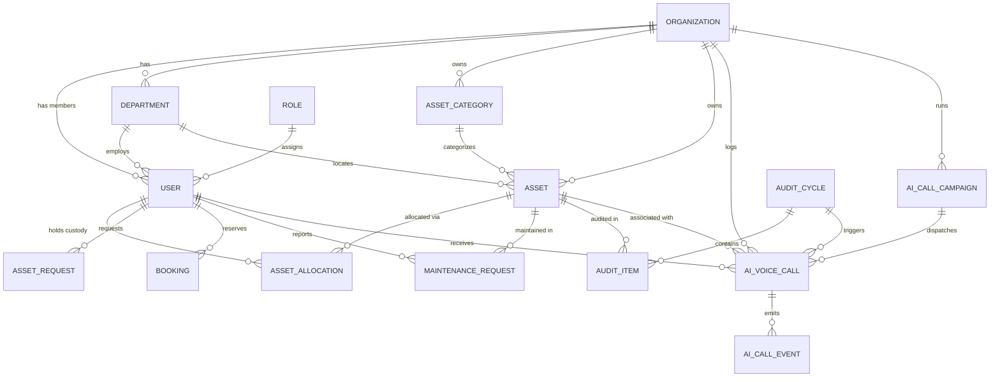

# 🚀 AssetFlow ERP — Backend API Engine

> **Enterprise Asset & Resource Management System — Production REST API, Multi-Tenant Architecture & OmniDimension AI Voice Suite**

---

## 📑 Table of Contents

- [1. System Overview](#1-system-overview)
- [2. Architecture & Tech Stack](#2-architecture--tech-stack)
- [3. Project Directory Structure](#3-project-directory-structure)
- [4. Database & Relational Data Model](#4-database--relational-data-model)
- [5. Authentication, Security & Multi-Tenancy](#5-authentication-security--multi-tenancy)
- [6. OmniDimension AI Voice & Telephony Architecture](#6-omnidimension-ai-voice--telephony-architecture)
- [7. Complete REST API Reference](#7-complete-rest-api-reference)
  - [Authentication & User Session](#71-authentication--session-routes-apiauth)
  - [Organizations & Onboarding](#72-organization--onboarding-routes)
  - [Users & Employee Management](#73-users--employees-apiusers-apiemployees)
  - [Departments & Asset Categories](#74-departments--categories-apidepartments-apicategories)
  - [Hardware & Software Assets](#75-assets-management-apiassets)
  - [Allocations, Custody & Transfers](#76-allocations--transfers-apiallocations)
  - [Resource & Room Bookings](#77-resource-bookings-apibookings)
  - [Maintenance & Service Tickets](#78-maintenance--repair-requests-apimaintenance)
  - [Audit Cycles & Physical Verifications](#79-asset-audits-apiaudits)
  - [Asset Requisitions & Requests](#710-asset-requests-apiasset-requests)
  - [Executive Analytics & Dashboard Stats](#711-executive-dashboard--analytics-apidashboard)
  - [Notifications & Activity Audit Trail](#712-notifications--activity-logs)
  - [OmniDimension Voice Calling & Assistant](#713-omnidimension-ai-voice-suite-apiai-voice)
  - [Webhooks & Telephony Callbacks](#714-webhooks--integrations-apiintegrationsomnidimension)
- [8. Environment Configuration (`.env`)](#8-environment-configuration-env)
- [9. Setup, Installation & Database Initialization](#9-setup-installation--database-initialization)
- [10. Automated Validation & Test Suite](#10-automated-validation--test-suite)

---

## 1. System Overview

AssetFlow Backend is an enterprise-grade RESTful API built to streamline the entire asset lifecycle: requisitioning, procurement, automated onboarding, role-based custody allocation, meeting room & device reservations, maintenance scheduling, compliance auditing, and autonomous AI telephony.

### 🌟 Key Highlights:
- **Multi-Tenant Isolation**: Complete data partitioning by `organizationId`.
- **OmniDimension AI Voice Agent (Sophia)**: Autonomous phone calls for asset audits, maintenance follow-ups, warranty expiry alerts, and smart natural-language outbound employee notifications.
- **AI Voice Assistant (NLP)**: Hybrid conversational engine that interprets fuzzy employee queries, performs safe CRUD operations, and dispatches automated voice calls with humanized instruction prompts.
- **Enterprise Security**: Cryptographic refresh token rotation with single-flight concurrency tolerance, rate limiting, helmet security headers, and granular Role-Based Access Control (RBAC).

---

## 2. Architecture & Tech Stack

```
                                    ┌────────────────────────┐
                                    │    Client Frontend     │
                                    │ (React / Vite / TS)    │
                                    └───────────┬────────────┘
                                                │ HTTPS / REST / Cookies
                                                ▼
┌────────────────────────────────────────────────────────────────────────────────────────┐
│                               AssetFlow Express 5 API Server                          │
│                                                                                        │
│  ┌──────────────────┐   ┌──────────────────────────┐   ┌────────────────────────────┐  │
│  │ Security & Auth  │   │     API Routing Layer    │   │  OmniDimension Voice API   │  │
│  │ (JWT, RBAC, Zod, │──▶│ (18 Domain-Driven Modular│──▶│ (Sophia Persona, Outbound │  │
│  │  Rate Limiting)  │   │      Router Modules)     │   │   Telephony, Webhooks)     │  │
│  └──────────────────┘   └─────────────┬────────────┘   └────────────────────────────┘  │
│                                       │                                                │
│                                       ▼                                                │
│                         ┌──────────────────────────┐                                   │
│                         │   Service Business Logic │                                   │
│                         │  (16 Specialized Domain  │                                   │
│                         │         Services)        │                                   │
│                         └─────────────┬────────────┘                                   │
│                                       │                                                │
│                                       ▼                                                │
│                         ┌──────────────────────────┐                                   │
│                         │   Prisma ORM & DB Repos  │                                   │
│                         │  (Relational Database)   │                                   │
│                         └──────────────────────────┘                                   │
└────────────────────────────────────────────────────────────────────────────────────────┘
```

| Component | Technology | Version | Purpose |
|---|---|---|---|
| **Runtime** | Node.js | v20+ / v24 | Server runtime engine |
| **Language** | TypeScript | `^5.8.0` | Strict static typing throughout codebase |
| **Framework** | Express | `^5.1.0` | High-performance asynchronous HTTP router |
| **Database ORM** | Prisma ORM | `^6.9.0` | Type-safe query builder, migrations & schema management |
| **Database Engine** | SQLite / PostgreSQL | – | Relational persistence with foreign-key constraints |
| **Authentication** | JWT (`jsonwebtoken`) | `^9.0.2` | Access (15m) & Refresh Token (7d) session handling |
| **Password Security**| `bcryptjs` | `^3.0.2` | Salted password hashing (cost factor 10) |
| **Validation** | `zod` | `^3.25.3` | Schema validation on all request bodies and queries |
| **AI Telephony** | OmniDimension API | REST / Webhook | Outbound AI phone calls, STT, TTS & sentiment analysis |
| **Email Service** | `resend` | `^6.18.1` | Transactional onboarding, ticket & credential emails |
| **File Storage** | `cloudinary` / Local | `^2.6.1` | Asset images, employee avatars & invoice receipts |
| **HTTP Security** | `helmet`, `cors` | `^8.1.0` | Security headers, CSP & CORS origin validation |
| **Rate Limiter** | `express-rate-limit` | `^7.5.0` | DoS protection (100 req/15 min on public endpoints) |

---

## 3. Project Directory Structure

```
backend/
├── prisma/
│   ├── schema.prisma              # 16+ Relational models, enums & foreign-key mappings
│   ├── seed.ts                    # Production database seeder (Roles, Categories, Admin)
│   ├── clear_demo_data.ts         # Utility to purge demo transactions
│   └── dev.db                     # SQLite database instance
├── src/
│   ├── config/
│   │   ├── database.ts            # Prisma Client singleton
│   │   ├── env.ts                 # Zod validated environment configuration
│   │   ├── jwt.ts                 # Access & refresh token signing/verification utils
│   │   └── cloudinary.ts          # Cloudinary media upload setup
│   ├── controllers/               # Express request handlers & HTTP response formatting
│   │   ├── activitylog.controller.ts
│   │   ├── aiVoice.controller.ts
│   │   ├── allocation.controller.ts
│   │   ├── asset.controller.ts
│   │   ├── assetRequest.controller.ts
│   │   ├── audit.controller.ts
│   │   ├── auth.controller.ts
│   │   ├── booking.controller.ts
│   │   ├── category.controller.ts
│   │   ├── dashboard.controller.ts
│   │   ├── department.controller.ts
│   │   ├── employee.controller.ts
│   │   ├── maintenance.controller.ts
│   │   ├── notification.controller.ts
│   │   ├── onboarding.controller.ts
│   │   ├── organization.controller.ts
│   │   └── user.controller.ts
│   ├── middlewares/               # Express middleware interceptors
│   │   ├── auth.ts                # authenticateToken & authorizeRole guards
│   │   ├── errorHandler.ts        # Centralized AppError normalizer & 404 handler
│   │   ├── rateLimiter.ts         # IP-based rate limiting configurations
│   │   └── upload.ts              # Multer multipart file upload handler
│   ├── repositories/              # Database query abstraction layer
│   ├── routes/                    # Express modular sub-routers (18 domain routes)
│   ├── scripts/                   # Automated CLI test runners and validation scripts
│   │   ├── test_omni_all_features.ts
│   │   └── test_ai_communications_all_subsections.ts
│   ├── services/                  # Core domain logic, external API clients & rules
│   │   ├── aiVoice.service.ts
│   │   ├── aiVoiceAssistant.service.ts
│   │   ├── allocation.service.ts
│   │   ├── asset.service.ts
│   │   ├── assetRequest.service.ts
│   │   ├── audit.service.ts
│   │   ├── auth.service.ts
│   │   ├── booking.service.ts
│   │   ├── category.service.ts
│   │   ├── dashboard.service.ts
│   │   ├── department.service.ts
│   │   ├── email.service.ts
│   │   ├── employee.service.ts
│   │   ├── maintenance.service.ts
│   │   ├── omnidimension.service.ts
│   │   └── organization.service.ts
│   ├── types/                     # Shared TypeScript interfaces & DTOs
│   ├── utils/                     # Password hashing, phone formatting, responses
│   ├── validators/                # Zod schemas for input validation
│   └── server.ts                  # Application entry point, bootstrap & route mounting
├── package.json
├── tsconfig.json
└── .env                           # Environment variables configuration
```

---

## 4. Database & Relational Data Model

The schema is defined in [`prisma/schema.prisma`](file:///d:/assetmanag/backend/prisma/schema.prisma) with complete relational integrity:



### Key Models Overview:
1. **`Organization`**: Multi-tenant root entity containing branding, settings, currency, and onboarding step state.
2. **`User`**: Accounts with BCrypt password hashes, role relationships, phone numbers, department links, lockouts, and refresh tokens.
3. **`Role`**: Predefined RBAC roles: `Administrator`, `Asset Manager`, `Department Head`, and `Employee`.
4. **`Asset`**: Physical/digital resources with barcode tags, serial numbers, purchase cost, depreciation, warranty, and lifecycle statuses (`AVAILABLE`, `ALLOCATED`, `RESERVED`, `MAINTENANCE`, `LOST`, `DISPOSED`, `RETIRED`).
5. **`AssetAllocation`**: Active and historical assignment records linking an asset to an employee with check-out and check-in timestamps.
6. **`TransferRequest`**: Multi-tier asset custody transfer workflows requiring Department Head and Asset Manager sign-offs.
7. **`Booking`**: Time-slotted reservations for shared resources (conference rooms, pooled projectors, company vehicles).
8. **`MaintenanceRequest`**: Repair tickets with issue logging, priority, assigned technicians, repair costs, and status tracking.
9. **`AuditCycle` & `AuditItem`**: Periodic verification batches tracking hardware status (`VERIFIED`, `MISSING`, `DAMAGED`).
10. **`AIVoiceCall`**: Voice call record capturing phone numbers, OmniDimension Call IDs, timestamps, sentiment, duration, summaries, and transcripts.
11. **`AICallCampaign`**: Batch campaign manager computing real-time verification rates and progress metrics.
12. **`AICallEvent`**: Chronological event stream (`INITIATED`, `RINGING`, `IN_PROGRESS`, `COMPLETED`, `FAILED`, `WEBHOOK_RECEIVED`).
13. **`AIAuditVerification`**: Immutable record of AI-driven voice audit outcomes.
14. **`Notification`**: Real-time in-app alerts categorized by event type with unread counters.
15. **`ActivityLog`**: Tamper-evident audit trail capturing user actions, IP addresses, resource targets, and timestamps.

---

## 5. Authentication, Security & Multi-Tenancy

### 🔐 Authentication Flow:
- **Access Tokens**: Short-lived JWTs (default 15 minutes) signed with `JWT_SECRET`.
- **Refresh Tokens**: Long-lived JWTs (default 7 days) signed with `JWT_REFRESH_SECRET`, stored in HTTP-only cookies and in the database.
- **Single-Flight Refresh Deduplication**:
  - The frontend `api.ts` multiplexes all concurrent `401 Unauthorized` errors through a single in-flight promise.
  - The backend `AuthService.refreshTokens` accommodates millisecond-level parallel requests using a cryptographic verification fallback without prematurely revoking active sessions.
- **Google OAuth 2.0**: Native authorization code exchange at `POST /api/auth/google/callback`.
- **Brute-Force Lockout**: 5 consecutive failed login attempts lock the account for 15 minutes.

### 🛡️ Role-Based Access Control (RBAC):
Endpoint authorization is enforced through the `authorizeRole(...)` middleware:
- **`Administrator`**: Full system access across all tenants, configuration, and logs.
- **`Asset Manager`**: Inventory CRUD, bulk imports, allocation approvals, maintenance management, and audit verification.
- **`Department Head`**: Departmental requisitions, user custody reviews, and internal transfer sign-offs.
- **`Employee`**: View assigned assets, submit broken device tickets, request hardware, and reserve conference rooms.

---

## 6. OmniDimension AI Voice & Telephony Architecture

AssetFlow features a deeply integrated voice automation engine using the **OmniDimension Conversational AI Platform**.

### 🎙️ The Persona: **Sophia**
Calls are placed by **Sophia**, an enterprise female voice agent configured with warm, clear, professional guidance (`voice: 'female'`, `voice_id: 'aura-asteria-en'`).

```
┌─────────────────┐       ┌────────────────────────┐       ┌────────────────────┐
│ Event / Request │──────▶│   AIVoiceService       │──────▶│   OmniDimension    │
│ (Maintenance,   │       │ • Context Aggregation  │       │     Voice API      │
│  Audit, Custom) │       │ • Script Normalization │       │ (Outbound Calling) │
└─────────────────┘       └───────────┬────────────┘       └─────────┬──────────┘
                                      │                              │
                                      │                              ▼
                                      │                      ┌─────────────────┐
                                      │                      │ Target Employee │
                                      │                      │  Phone (+E.164) │
                                      │                      └─────────┬───────┘
                                      ▼                                │
                          ┌────────────────────────┐                   │
                          │   Webhook Controller   │◀──────────────────┘
                          │ • Transcript Parsing   │  POST /api/integrations/
                          │ • Sentiment Analysis   │       omnidimension
                          │ • Audit State Update   │
                          └────────────────────────┘
```

### 📞 Core Telephony Capabilities:
1. **Automated Operational Triggers**:
   - **Maintenance Follow-ups**: Calls employees reporting broken hardware after 2 hours if unresolved.
   - **Asset Return Reminders**: Alerts employees holding equipment scheduled for return.
   - **Warranty Expiry Alerts**: Notifies IT staff and employees when device warranty nears expiration (<30 days).
   - **Quarterly Audit Verifications**: Dispatches automated possession check calls during audit cycles.
2. **Humane Spoken Script Generation**:
   - When an admin says: *"Call Shubham and ask him to contact me(the admin)"*, the system resolves `"me"` to the administrator's full name and instructs the AI agent to speak:
     > *"Hello! This is Sophia, the AssetFlow voice assistant calling on behalf of your administrator, [Admin Name]. [Admin Name] kindly requested that you get in touch with them directly at your earliest convenience. Could you please confirm you received this message?"*
3. **Conversational Assistant & Safety Guardrails**:
   - Classifies 30+ natural-language intents (inventory counts, maintenance lists, room bookings).
   - **Safety Filter**: Blocks destructive requests (e.g., *"drop table"*, *"delete all users"*).
   - **Approval Interceptor**: Converts direct reassignments into formal `TransferRequest` tickets instead of making unauthorized changes.
4. **Post-Call Webhook Processing**:
   - Captures conversation duration, recording URLs, complete transcripts, user sentiment (`positive`, `neutral`, `negative`), and structured entity extraction.
   - Automatically marks audit items as `VERIFIED`, `ASSET_MISSING`, or `ASSET_DAMAGED` in real time.

---

## 7. Complete REST API Reference

### 7.1. Authentication & Session Routes (`/api/auth`)

| Method | Endpoint | Access | Description |
|---|---|---|---|
| `POST` | `/api/auth/admin-register` | Public | Registers a new Company + Administrator account. |
| `POST` | `/api/auth/login` | Public | Authenticates credentials and returns JWT tokens. |
| `POST` | `/api/auth/refresh` | Public (Cookie) | Rotates refresh token and returns a fresh access token. |
| `POST` | `/api/auth/logout` | Authenticated | Clears user refresh token and revokes session. |
| `GET` | `/api/auth/me` | Authenticated | Retrieves current logged-in user profile & permissions. |
| `POST` | `/api/auth/forgot-password` | Public | Generates and emails password reset token. |
| `POST` | `/api/auth/reset-password` | Public | Validates reset token and sets new password. |
| `POST` | `/api/auth/google/callback` | Public | Exchanges Google OAuth code for authenticated JWT. |

---

### 7.2. Organization & Onboarding Routes

| Method | Endpoint | Access | Description |
|---|---|---|---|
| `GET` | `/api/organizations/current` | Authenticated | Retrieves current tenant organization metadata. |
| `PATCH` | `/api/organizations/current` | Admin | Updates company profile, logo, timezone, currency. |
| `GET` | `/api/onboarding/status` | Authenticated | Retrieves current onboarding wizard progression. |
| `POST` | `/api/onboarding/step` | Admin | Completes an onboarding step (`DEPARTMENTS`, `EMPLOYEES`, `ASSETS`). |

---

### 7.3. Users & Employees (`/api/users`, `/api/employees`)

| Method | Endpoint | Access | Description |
|---|---|---|---|
| `GET` | `/api/users` | Admin / Manager | Lists users with search, role, status & pagination filters. |
| `POST` | `/api/users` | Admin | Creates a user account with designation, phone, and role. |
| `GET` | `/api/users/:id` | Authenticated | Retrieves specific user profile by ID. |
| `PATCH` | `/api/users/:id` | Admin | Updates user status, phone, role, department, or profile. |
| `DELETE` | `/api/users/:id` | Admin | Soft-deletes user account and frees custody allocations. |
| `POST` | `/api/employees/bulk-import` | Admin | Bulk imports employees from CSV / JSON dataset. |
| `PATCH` | `/api/employees/change-password`| Authenticated | Updates account password. |

---

### 7.4. Departments & Categories (`/api/departments`, `/api/categories`)

| Method | Endpoint | Access | Description |
|---|---|---|---|
| `GET` | `/api/departments` | Authenticated | Lists all departments with employee & asset counts. |
| `POST` | `/api/departments` | Admin | Creates a new department. |
| `PATCH` | `/api/departments/:id` | Admin | Updates department name, description, or assigned head. |
| `DELETE` | `/api/departments/:id` | Admin | Deletes department (reassigns assets/users). |
| `GET` | `/api/categories` | Authenticated | Lists asset categories with icons and utilization stats. |
| `POST` | `/api/categories` | Admin | Creates an asset category. |
| `PATCH` | `/api/categories/:id` | Admin | Modifies category details or icon metadata. |
| `DELETE` | `/api/categories/:id` | Admin | Removes category if no active assets are linked. |

---

### 7.5. Assets Management (`/api/assets`)

| Method | Endpoint | Access | Description |
|---|---|---|---|
| `GET` | `/api/assets` | Authenticated | Full asset inventory with category, status, and search filters. |
| `POST` | `/api/assets` | Admin / Manager | Registers a new asset with barcode tag and specs. |
| `GET` | `/api/assets/:id` | Authenticated | Retrieves asset details, allocation history, and tickets. |
| `PATCH` | `/api/assets/:id` | Admin / Manager | Updates specifications, location, status, or warranty. |
| `DELETE` | `/api/assets/:id` | Admin | Soft-deletes asset or marks it as `DISPOSED`. |
| `POST` | `/api/assets/bulk-import` | Admin / Manager | Bulk CSV/JSON asset catalog ingestion. |

---

### 7.6. Allocations & Transfers (`/api/allocations`)

| Method | Endpoint | Access | Description |
|---|---|---|---|
| `GET` | `/api/allocations` | Authenticated | Lists active and historical custody allocations. |
| `POST` | `/api/allocations/check-out` | Admin / Manager | Allocates an available asset to an employee. |
| `POST` | `/api/allocations/check-in` | Admin / Manager | Checks in an allocated asset back to inventory. |
| `POST` | `/api/allocations/transfer-request` | Authenticated | Initiates a custody transfer request between employees. |
| `PATCH` | `/api/allocations/transfer-request/:id/approve` | Dept Head / Admin | Approves a pending transfer request. |
| `PATCH` | `/api/allocations/transfer-request/:id/reject` | Dept Head / Admin | Rejects a custody transfer request. |

---

### 7.7. Resource Bookings (`/api/bookings`)

| Method | Endpoint | Access | Description |
|---|---|---|---|
| `GET` | `/api/bookings` | Authenticated | Lists room and shared device reservations. |
| `POST` | `/api/bookings` | Authenticated | Reserves a resource for a specified date/time slot. |
| `PATCH` | `/api/bookings/:id/cancel` | Authenticated | Cancels an upcoming booking reservation. |
| `PATCH` | `/api/bookings/:id/status` | Admin / Manager | Confirms or rejects a pending booking request. |

---

### 7.8. Maintenance & Repair Requests (`/api/maintenance`)

| Method | Endpoint | Access | Description |
|---|---|---|---|
| `GET` | `/api/maintenance` | Authenticated | Lists repair tickets with status and severity filters. |
| `POST` | `/api/maintenance` | Authenticated | Submits a hardware defect or repair ticket. |
| `PATCH` | `/api/maintenance/:id/assign` | Admin / Manager | Assigns a technician to a repair ticket. |
| `PATCH` | `/api/maintenance/:id/resolve` | Admin / Manager | Marks ticket resolved with repair notes and costs. |

---

### 7.9. Asset Audits (`/api/audits`)

| Method | Endpoint | Access | Description |
|---|---|---|---|
| `GET` | `/api/audits/cycles` | Authenticated | Lists periodic audit verification cycles. |
| `POST` | `/api/audits/cycles` | Admin / Manager | Creates a new audit verification cycle. |
| `GET` | `/api/audits/cycles/:id` | Authenticated | Retrieves cycle audit items and progress metrics. |
| `POST` | `/api/audits/items/:id/verify`| Admin / Manager | Manually verifies or flags an audit item status. |

---

### 7.10. Asset Requests (`/api/asset-requests`)

| Method | Endpoint | Access | Description |
|---|---|---|---|
| `GET` | `/api/asset-requests` | Authenticated | Lists hardware requisition requests. |
| `POST` | `/api/asset-requests` | Employee | Submits a new asset requisition request. |
| `PATCH` | `/api/asset-requests/:id/approve` | Manager / Admin | Approves requisition and initiates procurement. |
| `PATCH` | `/api/asset-requests/:id/reject` | Manager / Admin | Rejects requisition with reason. |

---

### 7.11. Executive Dashboard & Analytics (`/api/dashboard`)

| Method | Endpoint | Access | Description |
|---|---|---|---|
| `GET` | `/api/dashboard/admin-stats` | Admin / Manager | Executive metrics (total assets, costs, utilization %, alerts). |
| `GET` | `/api/dashboard/utilization` | Admin / Manager | Departmental asset utilization breakdowns. |
| `GET` | `/api/dashboard/maintenance-frequency` | Admin / Manager | Monthly maintenance incident trends. |
| `GET` | `/api/dashboard/most-used` | Admin / Manager | Most reserved equipment and meeting rooms. |
| `GET` | `/api/dashboard/recent-activity` | Authenticated | Real-time chronological audit trail feed. |

---

### 7.12. Notifications & Activity Logs

| Method | Endpoint | Access | Description |
|---|---|---|---|
| `GET` | `/api/notifications` | Authenticated | Fetches user notifications with unread count. |
| `PATCH` | `/api/notifications/:id/read` | Authenticated | Marks a specific notification as read. |
| `PATCH` | `/api/notifications/read-all` | Authenticated | Marks all notifications as read. |
| `GET` | `/api/activity-logs` | Admin | Comprehensive system activity audit log. |

---

### 7.13. OmniDimension AI Voice Suite (`/api/ai-voice`)

| Method | Endpoint | Access | Description |
|---|---|---|---|
| `POST` | `/api/ai-voice/calls/initiate` | Admin / Manager | Dispatches a single outbound AI voice call to an employee. |
| `GET` | `/api/ai-voice/calls/history` | Authenticated | Lists call records with status, purpose, and date filters. |
| `GET` | `/api/ai-voice/calls/:id` | Authenticated | Retrieves call details, sentiment, summary, and transcript. |
| `POST` | `/api/ai-voice/campaigns` | Admin / Manager | Creates and executes a bulk AI calling campaign. |
| `GET` | `/api/ai-voice/campaigns` | Authenticated | Lists all campaigns with live completion metrics. |
| `GET` | `/api/ai-voice/campaigns/:id` | Authenticated | Retrieves campaign progress, verified %, and call list. |
| `POST` | `/api/ai-voice/automated-triggers/scan` | Admin | Manually scans and triggers operational follow-up calls. |
| `POST` | `/api/ai-voice/assistant/query` | Authenticated | NLP query endpoint for the floating Voice Assistant modal. |
| `POST` | `/api/ai-voice/calls/:id/simulate-webhook` | Admin | Test simulator for verifying post-call webhooks and transcripts. |

---

### 7.14. Webhooks & Integrations (`/api/integrations/omnidimension`)

| Method | Endpoint | Access | Description |
|---|---|---|---|
| `POST` | `/api/integrations/omnidimension/webhook` | Public (OmniDimension) | Receives real-time call lifecycle events, transcripts & audit outcomes. |
| `POST` | `/api/omnidimension/webhook` | Public (OmniDimension) | Secondary alias for OmniDimension post-call callback. |

---

## 8. Environment Configuration (`.env`)

Create a `.env` file in the `backend/` root directory:

```env
# ─── Database ──────────────────────────────────────────────────
DATABASE_URL="file:./dev.db"

# ─── JWT Authentication ─────────────────────────────────────────
JWT_SECRET="your-super-secret-jwt-key-min-32-characters-long"
JWT_REFRESH_SECRET="your-super-secret-refresh-key-min-32-chars"
JWT_EXPIRES_IN="15m"
JWT_REFRESH_EXPIRES_IN="7d"

# ─── Server & CORS ──────────────────────────────────────────────
PORT=5000
NODE_ENV="development"
CORS_ORIGIN="http://localhost:5173"
FRONTEND_URL="http://localhost:5173"
APP_URL="http://localhost:5173"

# ─── OmniDimension AI Voice Engine ──────────────────────────────
OMNIDIM_API_KEY="your_omnidimension_api_key"
OMNIDIM_BASE_URL="https://backend.omnidim.io/api/v1"
OMNIDIM_DEFAULT_AGENT_ID=""
OMNIDIM_WEBHOOK_SECRET=""

# ─── Email Communications (Resend) ──────────────────────────────
RESEND_API_KEY=""
EMAIL_FROM="AssetFlow <onboarding@resend.dev>"

# ─── Google OAuth 2.0 ───────────────────────────────────────────
GOOGLE_CLIENT_ID=""
GOOGLE_CLIENT_SECRET=""
GOOGLE_CALLBACK_URL="http://localhost:5000/api/auth/google/callback"

# ─── Cloudinary Media Storage ───────────────────────────────────
CLOUDINARY_CLOUD_NAME=""
CLOUDINARY_API_KEY=""
CLOUDINARY_API_SECRET=""
```

---

## 9. Setup, Installation & Database Initialization

### 1. Install Dependencies
```bash
cd backend
npm install
```

### 2. Generate Prisma Client & Push Schema
```bash
npm run db:generate
npm run db:push
```

### 3. Seed Default System Roles & Categories
```bash
npm run db:seed
```

### 4. Launch Development Server
```bash
npm run dev
```

The API will be available at `http://localhost:5000/api` with health checks at `http://localhost:5000/api/health`.

---

## 10. Automated Validation & Test Suite

The backend contains automated test scripts verifying multi-tenancy, database persistence, and the complete OmniDimension AI voice suite:

### Run Full OmniDimension AI Voice Test Suite:
```bash
npx tsx src/scripts/test_omni_all_features.ts
```

### Run Sub-sections & Humane Voice Validation:
```bash
npx tsx src/scripts/test_ai_communications_all_subsections.ts
```

### Type Checking:
```bash
npx tsc --noEmit
```
*(Ensures 0 TypeScript compilation errors across the entire codebase)*

---

**Developed for AssetFlow Enterprise ERP** — Robust, Scalable, and Autonomous Asset Management.
